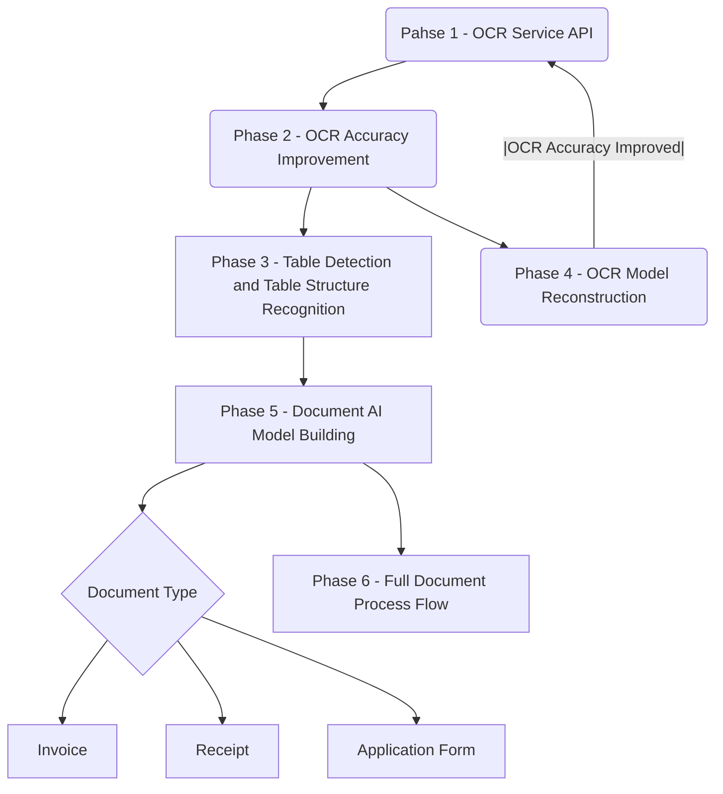
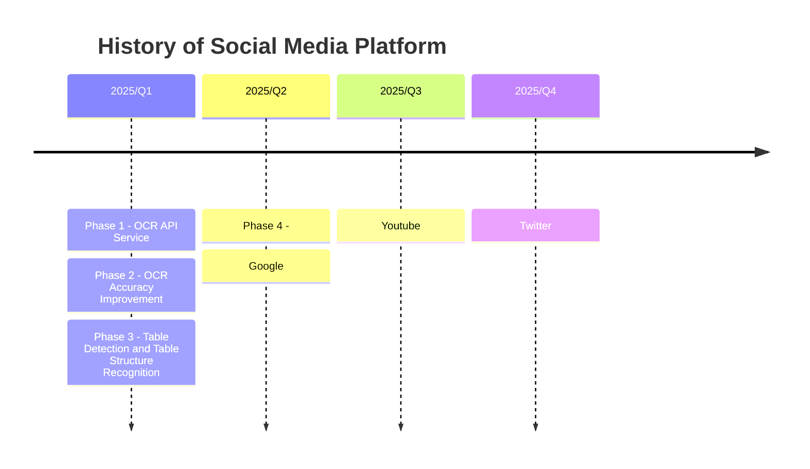

# Roadmap

## Roadmap

## Timeline

## Phase 1 - OCR Service API
- To build a OCR microservice
- Version v. 0.1 
- Features
	- To upload an image file
	- To recognize the content to text using Tesseract OCR
- Tech Stacks
	- FastAPI
	- Celery
	- Redis Queue
	- Docker

## Phase 2 - OCR Accuracy Improvement
- To improve Tesseract ocr for Traditional Chinese character recognition
- Version: v. 0.2 
- Features
	- To recognize at least 12000 mostly used printed characters
- Tech Stacks
	- Machine Learning - Pytorch

## Phase 3 - Table Detection and Table Structure Recognition
- Go through a complete Table Detection workflow with an existed model
- Features
	- upload image file
	- Table Detection
	- Table Structure Recognition 
	- OCR
	- Export to Json
	- convert to a dataframe

## Phase 4 - OCR Model Reconstruction

- To improve Tesseract ocr for Traditional Chinese character recognition
- Version: v. 0.2 
- Features
	- To recognize at least 12000 most used printed characters
- Tech Stacks
	- Machine Learning - Pytorch

## Phase 5 - Document AI Model Building 

## Phase 6 - Full Document Process Flow
To create a Document Layout Parsing  → Json → HTML(Markdown)
Including:

- File upload
- Image Pre-processing
- Layout Parsing
- Reading Order
- OCR for Traditional Chinese
-  Conversion to : Json, Markdown, HTML
- FastAPI
- Deploy in AWS

## Phase 7 - Process Model
To improve OCR accuracy

## Phase 6 - Different Document Types
To include Auto-annotation with pre-trained model. Try to make the solution as a self-training loop.

## Phase 8
To Improve UI 