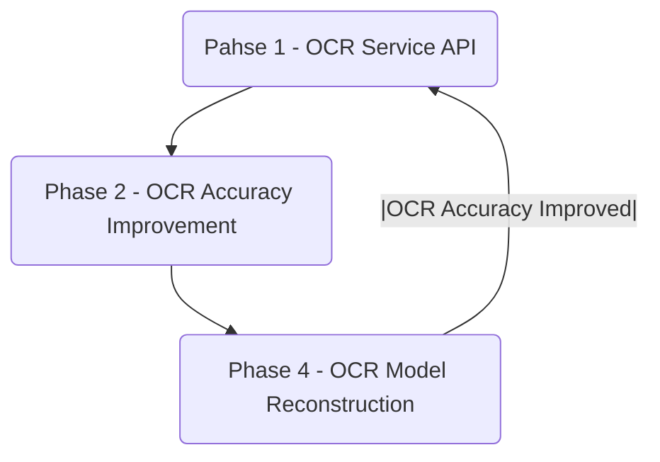
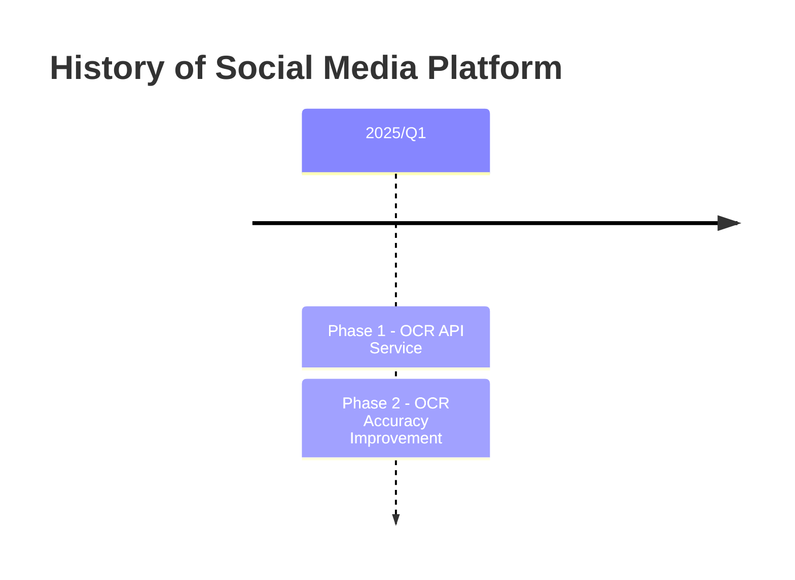

# Roadmap

## Roadmap

## Timeline

## Phase 1 - OCR Service API
- To build a OCR microservice
- Version v. 0.1 
- Features
	- To upload an image file
	- To recognize the image content to text

## Phase 2 - OCR Accuracy Improvement
- To improve  ocr Service for Traditional Chinese character recognition
- Version: v. 0.2 
- Features
- Tech Stacks
	- Machine Learning - Pytorch

